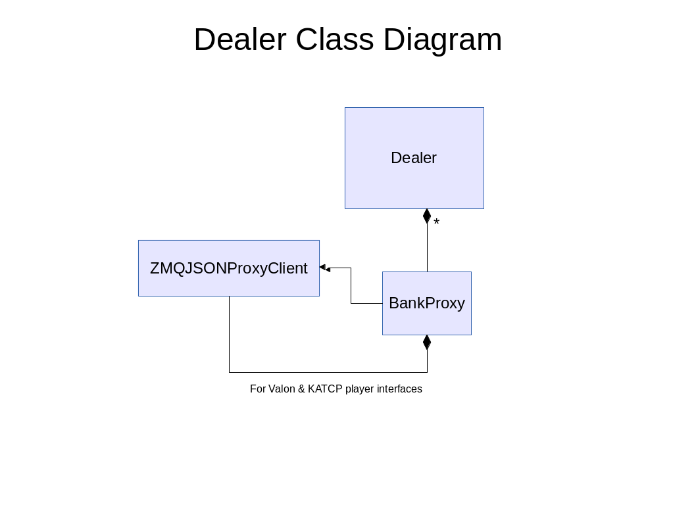

Dealer Class Documentation
==========================

The Dealer is a lightweight client to all the Players. It allows one script to control all the Players from one machine. The only requirement for the Dealer is the Dealer code itself, a current ZeroMQ python installation, and access to the ``dibas.conf`` configuration file.

When first run, the Dealer connects to each Player specified in ``dibas.conf``, and dynamically obtains all the control functions exported by the Player, including KATCP and Valon functions, needed to run each Player (thus updates to the Player code will show up in the Dealer automatically). The user can then script all the Players at once, or address each one individually.

   *Figure 1: Dealer class diagram*

Dealer documentation:
---------------------

.. automodule:: dealer
.. autoclass:: Dealer
   :members:
