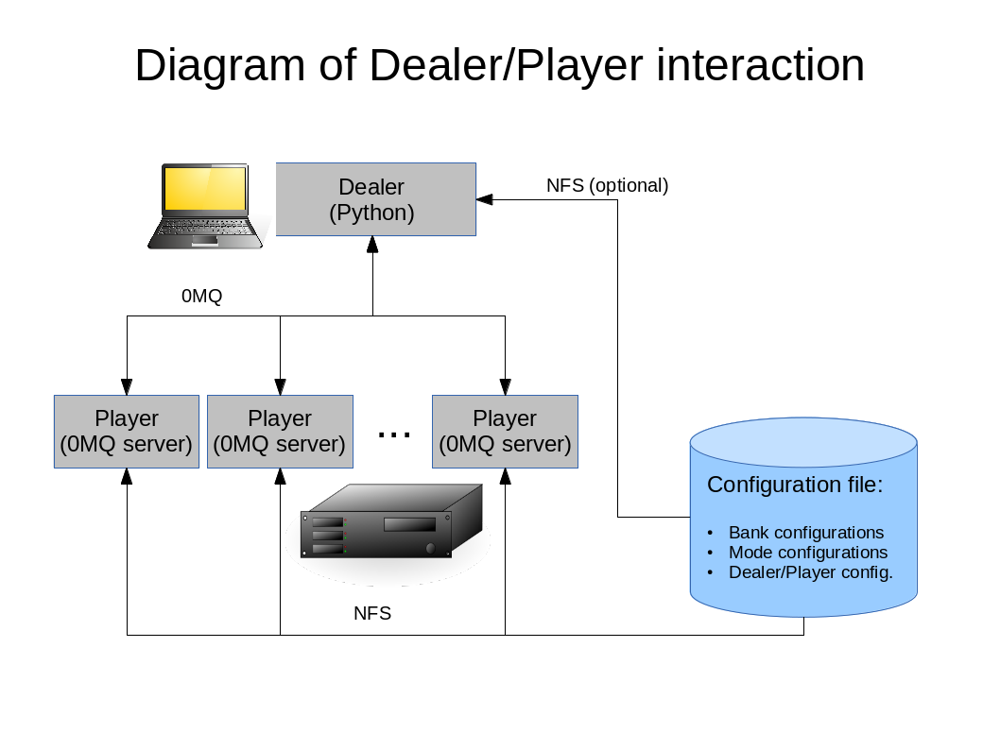

Introduction
============

The DIBAS spectrometer control software is a distributed system written in Python that consists of several backend servers, each running on an HPC computer, designated as *Players*, controlled and coordinated by a simple client library called the *Dealer* using a ZeroMQ RPC mechanism with JSON encoding.

   *Figure 1: Block diagram of Dealer and Players*

The Player
==========

Players may either be run interactively (useful for debugging), or be run as daemons and may remain running indefinitely. Players must know a great deal about the DIBAS configuration, and must have access to the DIBAS configuration file, VEGAS and GUPPI libraries and DAQ programs, and all needed 3d party modules.

Running the Player
------------------

The player may be run interactively. As user `dibas` on the desired HPC machine::

   $ source /opt/dibas/dibas.bash
   $ cd /opt/dibas/lib/python
   $ ipython -i player.py
   In [1]: p = Bank('BANKA') # 'Bank' is the main Player class
   In [2]: p.get_status() # etc...

This is very useful to debug specific problems in Player configuration. (The use of ipython for this purpose is highly recommended as it provides discovery of object attributes and full access to all attribute docstrings.)

For everyday use however the Players should be run as daemons, one on each HPC machine. Again, as user `dibas`, on the desired HPC machine::

   $ source /opt/dibas/dibas.bash
   $ player

The Player may be provided with an optional Bank identifier, which must have a matching section header in the configuration file. If not provided the Player will look at the configuration file and find the section that corresponds to the host it is running on and use that section header as a name.

**NOTE:** Managing multiple players on DIBAS is tedious, since there are up to 8 players involved. For this reason it is recommended that a package such as `Supervisor <http://supervisord.org/>`_ be used to manage the daemons.

The Dealer
==========

The Dealer library is lightweight in comparison to the Player. A Dealer only needs to know the URL(s) of one or more player(s), and will obtain all the information it needs from those Players. In addition to the Dealer code itself (``dealer.py`` & ``ZMQJSONProxy.py``), the Python installation for a Dealer needs only one specialized library, PyZMQ.

The Dealer may either be run interactively, or may be imported into scripts or the telescope control system as needed.

Dealers may come and go as needed. Further, there may be more than one Dealer running at any given time, each with a designated function. For example a status display program may run the Dealer interface to obtain status information for each Player and display it in one convenient location. Another Dealer may be included in the telescope control system and may be tasked with starting and stopping scans under telescope control. Yet another Dealer may be used in a user script to set up observations.

**NOTE**: In case of multiple Dealers care must be taken that Dealers do not issue conflicting instructions to Players.

Using the Dealer
----------------

The Dealer is not meant to be a stand-alone program. It is designed instead to be imported as a module in a Python program or script::

   $ source /opt/dibas/dibas.bash
   $ ipython
   In [1]: import dealer
   In [2]: d = dealer.Dealer()

In this example the Dealer is given no configuration information, so it fetches Player information from the DIBAS configuration file ``dibas.conf``. If this is not practical or desirable Player information may be supplied directly to the constructor in the form of a dictionary::

   $ ipython # no need to source dibas.bash
   In [1]: import dealer
   In [2]: players = {'BANKA':'tcp://172.18.0.1:6667', 'BANKB':'tcp://172.18.0.2:6667'}
   In [3]: d = dealer.Dealer(players)

In this case the URLs provided to the Dealer provide it with the information it needs to connect to the Players.
