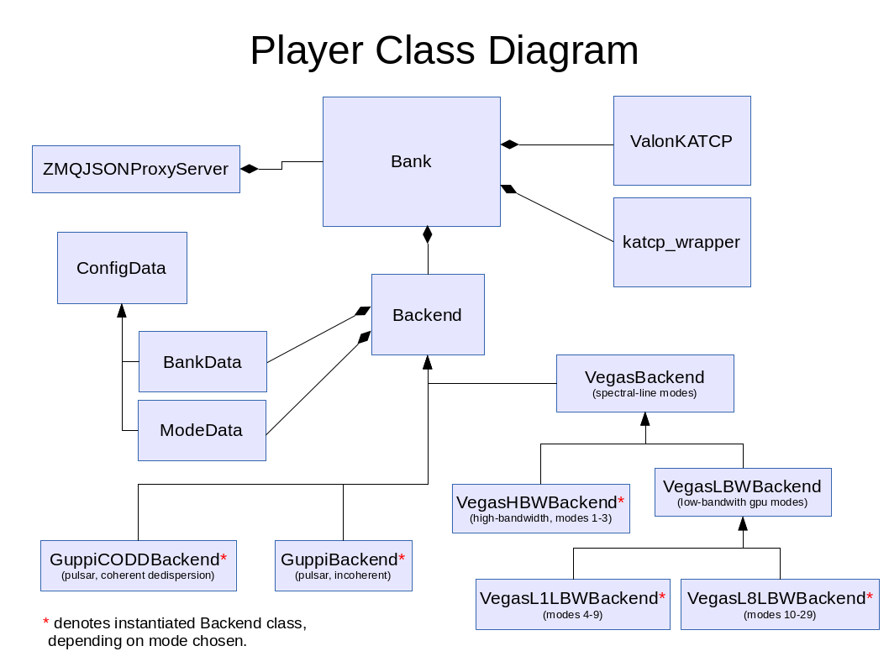

Player Class Documentation
==========================

The player is software that controls one 'bank', i.e. one roach and/or one HPC computer. The player is usually run as a daemon program, but may be run interactively for debugging or testing using only one bank.

   *Figure 1: Player class diagram*

Contents:

.. toctree::
   :maxdepth: 1

   bank
   backend
   configdata
   valon_katcp
